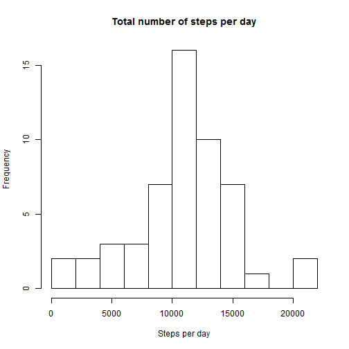
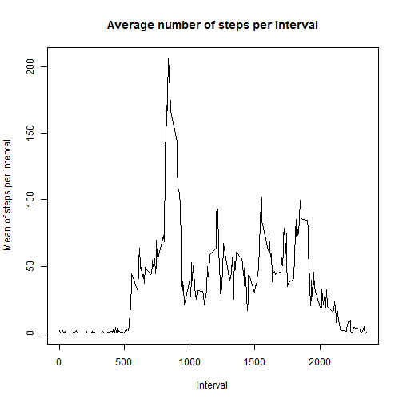
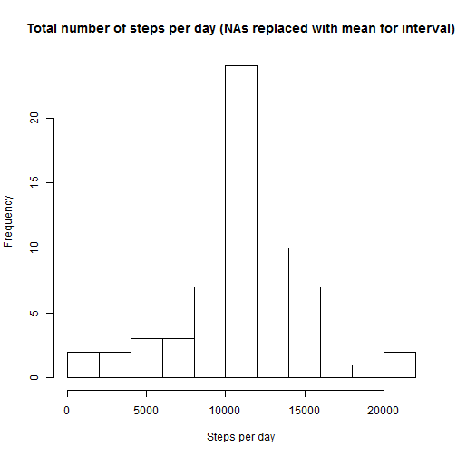
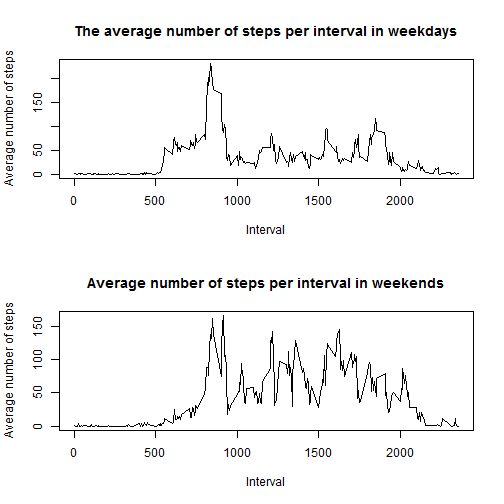

# Reproducible Research: Peer Assessment 1


## Loading and preprocessing the data

```r
# read table, process date column, sum total steps per day
data <- read.csv("activity.csv", header = T, colClasses = c("numeric", "character", 
    "numeric"))
data$date <- as.Date(data$date, format = "%Y-%m-%d", tz = "")
data <- data[order(data$date, data$interval), ]
str(data)
```

```
## 'data.frame':	17568 obs. of  3 variables:
##  $ steps   : num  NA NA NA NA NA NA NA NA NA NA ...
##  $ date    : Date, format: "2012-10-01" "2012-10-01" ...
##  $ interval: num  0 5 10 15 20 25 30 35 40 45 ...
```

```r
totalStepsPerDay <- aggregate(steps ~ date, data, sum)
```


## What is mean total number of steps taken per day?


```r
# create histogram of total number of steps per day
hist(totalStepsPerDay$steps, breaks = 10, main = "Total number of steps per day", 
    xlab = "Steps per day")
```

 

```r
mean.steps <- round(mean(totalStepsPerDay$steps), 2)
median.steps <- round(median(totalStepsPerDay$steps), 2)
```

**The mean and median for the total number of steps per day:**  
- **Mean: 10766.19**
- **Median: 10765**

## What is the average daily activity pattern?

```r
averageStepsPerInterval <- aggregate(steps ~ interval, data, mean)
plot(averageStepsPerInterval$interval, averageStepsPerInterval$steps, type = "l", 
    xlab = "Interval", ylab = "Mean of steps per interval", main = "Average number of steps per interval")
```

 

```r
i <- which(averageStepsPerInterval$steps == max(averageStepsPerInterval$steps))
max.steps <- round(max(averageStepsPerInterval$steps), 0)
av.spi <- averageStepsPerInterval$interval[i]
```

The **104<sup>th</sup> interval (835)** has the maximum number of steps (**206**) on the average.

## Imputing missing values

```r
# inputting missing values in a new dataset(data.replacena) with means for
# interval
data.replacena <- data
l <- nrow(data.replacena)
for (j in 1:l) {
    if (is.na(data.replacena$steps[j])) {
        interval <- data.replacena$interval[j]
        nrSteps <- averageStepsPerInterval$steps[averageStepsPerInterval$interval == 
            interval]
        data.replacena$steps[j] <- nrSteps
    }
}
str(data.replacena)
```

```
## 'data.frame':	17568 obs. of  3 variables:
##  $ steps   : num  1.717 0.3396 0.1321 0.1509 0.0755 ...
##  $ date    : Date, format: "2012-10-01" "2012-10-01" ...
##  $ interval: num  0 5 10 15 20 25 30 35 40 45 ...
```

```r
totalStepsPerDayCor <- aggregate(steps ~ date, data = data.replacena, sum)
hist(totalStepsPerDayCor$steps, breaks = 10, main = "Total number of steps per day (NAs replaced with mean for interval)", 
    xlab = "Steps per day")
```

 

```r
mean2.steps <- round(mean(totalStepsPerDayCor$steps), 2)
median2.steps <- round(median(totalStepsPerDayCor$steps), 2)
```

**The mean and median for the total number of steps per day (when NAs replaced):**  
- **Mean: 10766.19**
- **Median: 10766.19**  

**The mean has not changed with NAs replacements, but the median has changed** 

## Are there differences in activity patterns between weekdays and weekends?

```r
data.replacena$weekday <- as.factor(weekdays(data.replacena$date))
weekend.subset <- subset(data.replacena, weekday %in% c("Saturday", "Sunday"))
weekday.subset <- subset(data.replacena, !weekday %in% c("Saturday", "Sunday"))

averageStepsPerIntervalWE <- aggregate(steps ~ interval, weekend.subset, mean)
averageStepsPerIntervalWD <- aggregate(steps ~ interval, weekday.subset, mean)

par(mfrow = c(2, 1))
plot(averageStepsPerIntervalWD$interval, averageStepsPerIntervalWD$steps, type = "l", 
    main = "The average number of steps per interval in weekdays", xlab = "Interval", 
    ylab = "Average number of steps")
plot(averageStepsPerIntervalWE$interval, averageStepsPerIntervalWE$steps, type = "l", 
    main = "Average number of steps per interval in weekends", xlab = "Interval", 
    ylab = "Average number of steps")
```

 

```r

averageStepsPerDayWE <- aggregate(steps ~ date, weekend.subset, sum)
mean.we <- round(mean(averageStepsPerDayWE$steps), 0)
averageStepsPerDayWD <- aggregate(steps ~ date, weekday.subset, sum)
mean.wd <- round(mean(averageStepsPerDayWD$steps), 0)
```

**There is a greater number of steps on average in weekends days than in weekdays days**  
- **Weekend day: 12202 steps**
- **Weekday day: 10256 steps**
